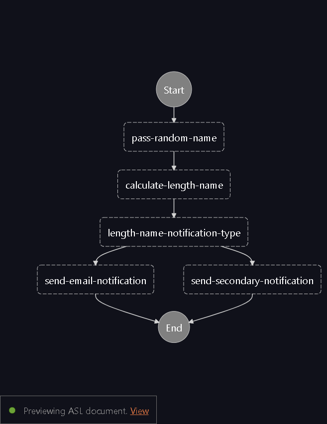
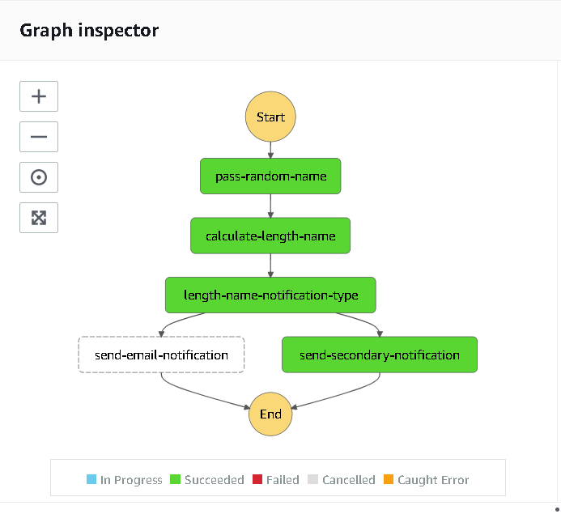

# lambda-stepfunctions-tf
### Lambda orchestration with terraform

### Aim: Orchestration of lambdas and publish SNS basec on condition

# AWS Components Overview:
* Lambda
  * pass-random-name: This lambda generated a random name and return event with the name
  * calculate-length-name: This will get the name in the event and claculates the length
* SNS
  * send-email-notification: email notification if length is greater than 10 email1@gmail.com
  * send-secondary-notification: email notification if length less than equal to 10 email2@gmail.com
* Step Functions
  * all of the above components are orchestating in a worflow 
  * Flow looks like below
  * 

# Testing the project:
* Clone the project: git clone https://github.com/spkosana/lambda-stepfunctions-tf.git
* cd lambda-stepfunctions-tf
* Pre-requisites:
  * cd terraform. 
  * create terraform.tfvars in terraform directory. 
  * Add below values in the file. Add your own values
    * region="us-east-2"
    * profile="terraform"
    * runtime = "python3.8"
    * sns_subscription_email_address ="email1@gmail.com"
    * secondary_sns_subscription_email_address = "email2@gmail.com"
* make plan
* make apply
* After above step , below are created in aws account
  * Roles
    * Lambda
    * Stepfunctions
    * events
  * Lambdas
    * pass-random-name
    * calculate-length-name
  * SNS Topic
    * email-notification
    * secondary-email-notification
  * Events
    * Trigger Rule
  * Step Function
* Step function will be executed as daily job ( as per my configurations )

# Execution image

# Destroy the resources VERY VERY IMPORTANT
* make destory
